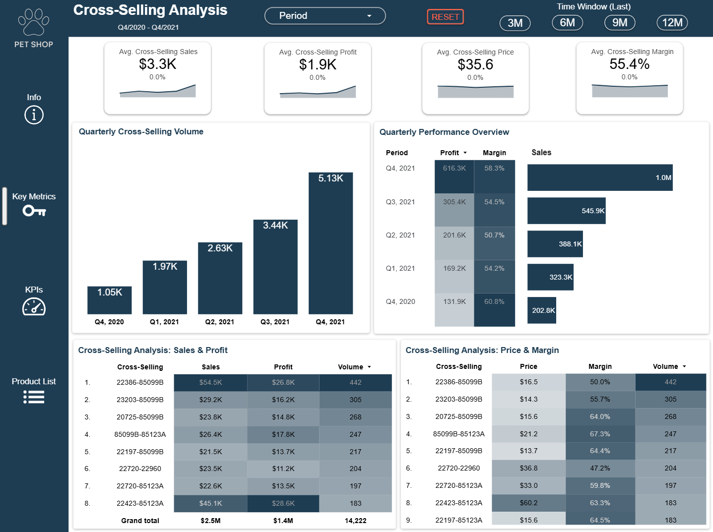

# Cross-Selling Analysis — E-Commerce Case Petshop

This repository contains an end-to-end analytics project focused on analysing cross-selling performance within an e-commerce pet shop environment.

The objective is to identify frequently purchased product combinations, quantify their revenue and profitability effects, and visualise behavioural cross-selling patterns through an interactive dashboard.

---

## Project Structure

📁 Data/         → Input files used for analysis  
📁 Images/       → Dashboard Preview, Icons for Dashboard 
📁 Notebook/     → Python notebook with preparation, feature engineering and EDA  
📁 Report/       → PDF report for stakeholders / portfolio
📄 LICENSE       → MIT License  
📄 README.md     → Project documentation

---

## Business Context

Retailers often have limited visibility into:

- which products are purchased together,
- which combinations generate additional profit,
- and how cross-selling behaviour evolves over time.

This project provides insight to support pricing, merchandising, assortment planning and commercial strategy.

---

## Key Features

- Data cleaning and transformation (SQL + Python)
- Metric development including:
  - transaction count
  - sales and profit attribution
  - margin contribution
  - cross-selling rate
  - support, confidence and lift  
- Exploratory Data Analysis to understand:
  - distributional patterns
  - pricing and profit behaviour
  - cross-sell strength
- Quarter-over-quarter trend evaluation
- Business-ready interactive dashboard

---

## Dashboard

The Looker Studio dashboard presents:

- Key aggregated metrics
- Cross-selling performance trends
- Ranking of product pairs
- A product list view linking descriptions and metrics

Link to dashboard:  
https://lookerstudio.google.com/reporting/8823545f-b537-4607-ae20-4a072a628276

Tip: Use “More Options → Present” to view in full-screen mode.

---

## Notebook

The repository includes a Jupyter notebook demonstrating:

- Data preparation
- SQL logic for metric construction
- Exploratory data analysis
- Interpretation notes for the insights

File: `ECommerce_Dataprep_EDA.ipynb`

---

## Technologies Used

- Python (Pandas, NumPy, Matplotlib, Seaborn)
- SQL / BigQuery
- Looker Studio

---

## Business Questions Addressed

- Which product combinations generate the most revenue and profit?
- How strong are cross-selling relationships (confidence, lift)?
- How does cross-selling behaviour change over time?
- Which products are suitable for bundling or recommendation strategies?

---

## Potential Extensions

- Market basket clustering
- Recommendation modelling
- Promotion uplift simulation

---

## Author

Sefer Adiyaman  
Data Analyst — Portfolio Project

---

## License

This project is licensed under the MIT License.

